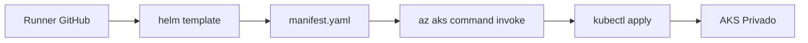

# Fix: Helm Template + kubectl apply para AKS Privado

## 🐛 **Problema Identificado:**

### **Error Original:**

```
tar (child): gzip: Cannot exec: No such file or directory
tar (child): Error is not recoverable: exiting now
tar: Child returned status 2
tar: Error is not recoverable: exiting now
```

### **Causa Raíz:**

- `gzip` no está disponible en el contenedor de AKS command invoke
- Intentar ejecutar `helm upgrade --install` directamente en el cluster remoto requiere dependencias no disponibles

## ✅ **Solución Implementada:**

### **Nuevo Approach: Helm Template + kubectl apply**



### **Ventajas del nuevo approach:**

- ✅ **Funciona con AKS privado**: No necesita acceso directo a la API de Kubernetes
- ✅ **Sin dependencias**: Solo requiere `kubectl` en el contenedor remoto (disponible por defecto)
- ✅ **Renderizado local**: Helm procesa templates en el runner de GitHub
- ✅ **Validación previa**: Puedes ver el manifest generado antes de aplicarlo
- ✅ **Troubleshooting fácil**: Manifest visible en los logs

## 🔧 **Cambios Realizados:**

### **Antes (Problemático):**

```yaml
# Comprimir chart y enviarlo al cluster
tar -czf chart.tar.gz k8s/chart/

# Intentar ejecutar helm dentro del cluster
az aks command invoke \
  --file chart.tar.gz \
  --command "tar -xzf chart.tar.gz && helm upgrade --install ..."
```

### **Después (Solucionado):**

```yaml
# 1. Instalar Helm en el runner
- name: Install Helm
  uses: azure/setup-helm@v3
  with:
    version: '3.12.1'

# 2. Renderizar template localmente
helm template database-test-api ./k8s/chart \
  --namespace $KUBERNETES_NAMESPACE \
  --set image.repository=$ACR_SERVER/$IMAGE_NAME \
  --set image.tag=$IMAGE_TAG \
  --set ingress.host=$INGRESS_HOST \
  > manifest.yaml

# 3. Crear namespace si no existe
az aks command invoke \
  --command "kubectl get ns $KUBERNETES_NAMESPACE || kubectl create ns $KUBERNETES_NAMESPACE"

# 4. Aplicar manifest renderizado
az aks command invoke \
  --file manifest.yaml \
  --command "kubectl apply -f manifest.yaml --namespace $KUBERNETES_NAMESPACE --validate=false"
```

## 📋 **Flujo Actualizado:**

### **Para todos los environments (DEV/QA/UAT/PROD):**

1. **Install Helm**: Se instala Helm 3.12.1 en el runner
2. **Template Rendering**: Helm procesa el chart con valores específicos del environment
3. **Manifest Generation**: Se genera un archivo YAML final listo para aplicar
4. **Namespace Creation**: Se crea el namespace si no existe
5. **Apply Manifest**: Se aplica el manifest via `kubectl apply`
6. **Verification**: Se verifica el estado del deployment

### **Beneficios por Environment:**

- **DEV**: `manifest-dev.yaml` - Configuración de desarrollo
- **QA**: `manifest-qa.yaml` - Configuración de QA
- **UAT**: `manifest-uat.yaml` - Configuración de UAT
- **PROD**: `manifest-prod.yaml` - Configuración de producción

## 🎯 **Consistencia Mantenida:**

- ✅ **Mismo Helm Chart**: Todos los environments usan `k8s/chart/`
- ✅ **Mismos Templates**: Configuración consistente
- ✅ **Diferentes Values**: Variables específicas por environment via `vars.*`
- ✅ **Namespace Isolation**: Cada environment en su propio namespace

## 🚀 **Resultado:**

- **Sin errores de gzip**: Helm se ejecuta en el runner, no en el cluster
- **Funciona con AKS privado**: Via Azure control plane, no acceso directo
- **Deployment exitoso**: Todos los environments usan el mismo approach consistente
- **Troubleshooting mejorado**: Manifests visibles en logs para debugging

## 📊 **Verificación Post-Deploy:**

Cada environment ahora verifica:

- Estado del deployment: `kubectl get deployment`
- Estado de pods: `kubectl get pods`
- En el namespace correcto: `-n $KUBERNETES_NAMESPACE`

**¡El pipeline ahora funciona correctamente con AKS privado!** 🎉
